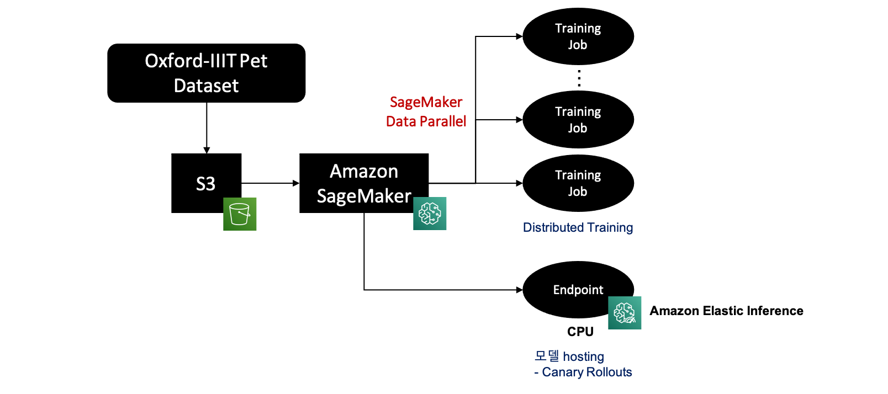
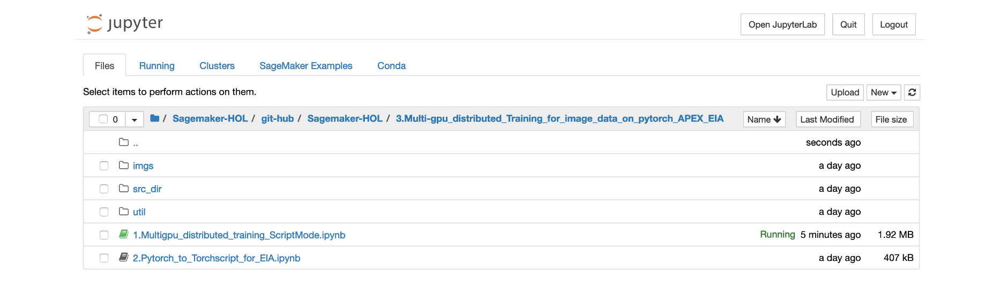

# Amazon SageMaker Distributed Training (Image Classification for Oxford-IIIT Pet Dataset)

### Training/Deploying Model for Image dataset

### 1. Hands-on Lab overview
In this hands-on lab, we are going to go through the steps below. 

### 2. Dataset Description
The Oxford-IIIT Pet Dataset provides 200 images of 37 different species of dogs and cats each, and Ground Truth also contains all information related to Classification, Object Detection, and Segmentation. We will continue training to solve the classification problem.

### 3. Hands-on lab process

This hands-on lab is configured to enable distributed training by launching several training jobs of SageMaker. In addition, when using ml.p3.8xlarge, ml.p3.16xlarge, ml.p3dn.24xlarge, and ml.p4dn.24xlarge with multiple GPUs together, all GPUs are configured to be used in Training. [SageMaker Distributed training](https://docs.aws.amazon.com/ko_kr/sagemaker/latest/dg/distributed-training.html) supports two methods such as [Data Parallel](https://docs.aws.amazon.com/ko_kr/sagemaker/latest/dg/data-parallel-intro.html) and [Model Parallel](https://docs.aws.amazon.com/ko_kr/sagemaker/latest/dg/model-parallel.html), and has superior performance because it is configured to fit the infrastructure of AWS rather than existing Distributed Training. Existing distributed training such as [Horovod](https://distributed-training-workshop.go-aws.com/) and [APEX](https://github.com/NVIDIA/apex)(A Pytorch EXtension) packages can also be performed. In this lab, a distributed training environment has been configured to run both SageMaker Data Parallel and APEX packages, and we will compare the performance and speed of the two through the lab.

After training is completed, the trained model will be deployed using SageMaker Endpoint. In this case, if you deploy with a low-cost CPU instead of a GPU, you can use Amazon Elastic Inference to perform the inference speed faster than the CPU.

## Clean up Resources

When the hands-on lab is over, you should delete all resources used in the lab to avoid unnecessary billing.

Before deleting below, please delete ***SageMaker Endpoint*** created through SageMaker Notebook through SDK command on each notebook creation page.

### Delete IAM Role

Go to the [IAM Role Console](https://console.aws.amazon.com/iam/#/roles), search for and find the IAM Role used in the lab, and click delete to delete it. For example, if you created an IAM Role with the same name as ***SageMakerIamRole*** during the lab, find it and delete it.

### Delete SageMaker Notebook

Go to the [SageMaker Console](https://ap-northeast-2.console.aws.amazon.com/sagemaker/home?region=ap-northeast-2#/dashboard), search for and find the notebook instance you used in the lab, and click ***delete*** to delete it. For example, if you created a notebook in the lab with a name like ***sagemaker-hol-lab***, find it and delete it.

### Delete S3 Bucket 

Go to the [S3 Console](https://s3.console.aws.amazon.com/s3/home?region=ap-northeast-2), search and find the two buckets we used in the lab, and click ***delete*** to delete them. For example, if you created S3 Buckets with names such as ***sagemaker-experiments-ap-northeast-2*** and ***sagemaker-ap-northeast-2*** in the course of the lab, find them and delete them.

## Contributors
- Youngjoon Choi (choijoon@amazon.com)
- Daekeun Kim (daekeun@amazon.com)